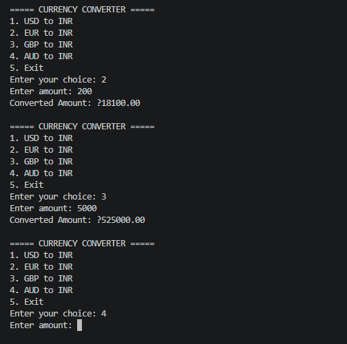

# DecodeLabs Java Project 4 — Currency Converter

## Student Details

**Student:** Purva Kurle  
**Project:** Project 4 — Currency Converter  
**Language:** Java

## Objective

The objective of this project is to create a Java-based Currency Converter application that converts different currencies into Indian Rupees (INR) using predefined exchange rates.

## Features

* Converts USD to INR.
* Converts EUR to INR.
* Converts GBP to INR.
* Converts AUD to INR.
* Allows users to enter the amount to be converted.
* Rejects negative amounts.
* Validates the user's menu choice.
* Displays the converted amount rounded to two decimal places.
* Allows users to perform multiple conversions.
* Provides an exit option.

## Concepts Used

* Java
* BigDecimal
* RoundingMode
* Scanner class
* Variables
* Arithmetic operations
* Switch statement
* While loop
* Conditional statements
* User input
* Input validation

## Currency Operations

* **USD to INR** — Converts US Dollars into Indian Rupees.
* **EUR to INR** — Converts Euros into Indian Rupees.
* **GBP to INR** — Converts British Pounds into Indian Rupees.
* **AUD to INR** — Converts Australian Dollars into Indian Rupees.
* **Exit** — Closes the Currency Converter application.

## Exchange Rates Used

* **1 USD = ₹83.50**
* **1 EUR = ₹90.50**
* **1 GBP = ₹105.00**
* **1 AUD = ₹54.50**

## How to Run

Compile the program:

    javac CurrencyConverter.java

Run the program:

    java CurrencyConverter

## Sample Output

    ===== CURRENCY CONVERTER =====
    1. USD to INR
    2. EUR to INR
    3. GBP to INR
    4. AUD to INR
    5. Exit

    Enter your choice: 1
    Enter amount: 100
    Converted Amount: ₹8350.00

### EUR to INR Example

    Enter your choice: 2
    Enter amount: 100
    Converted Amount: ₹9050.00

### GBP to INR Example

    Enter your choice: 3
    Enter amount: 100
    Converted Amount: ₹10500.00

### AUD to INR Example

    Enter your choice: 4
    Enter amount: 100
    Converted Amount: ₹5450.00

### Invalid Amount Example

    Enter amount: -100
    Please enter a valid positive amount.

### Exit Example

    Enter your choice: 5
    Thank you!

## Output Screenshot

## Project Structure

    Project-4-Currency-Converter
    ├── CurrencyConverter.java
    ├── README.md
    └── output.png

## Conclusion

This project helped me understand Java concepts such as BigDecimal, Scanner, switch statements, loops, conditional statements, and input validation. It also helped me understand how currency conversion can be performed using predefined exchange rates and how to display accurate results with two decimal places.
